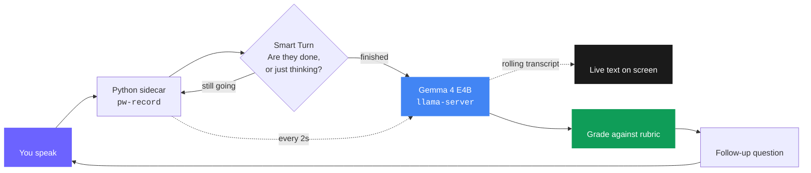
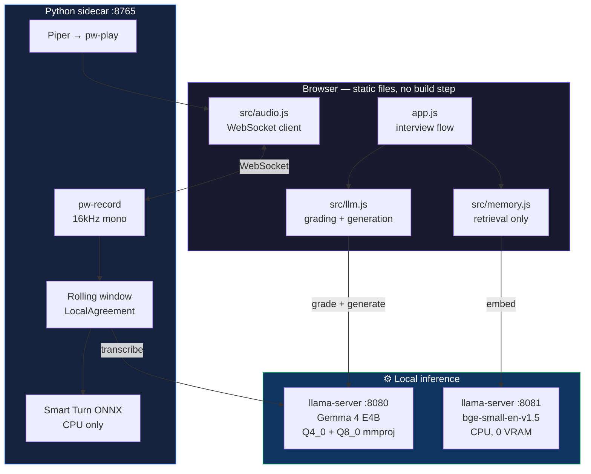
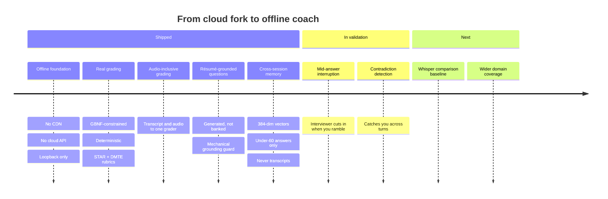

<div align="center">


# MockMate Gemma

### The interview coach that never phones home.


<br/>

[](#-the-offline-guarantee)
[](https://ai.google.dev/gemma)
[](https://github.com/ggml-org/llama.cpp)
[](#-measured-on-real-hardware)
[](LICENSE)

<br/>

**[Watch the demo](https://youtu.be/uGguoimej4w)**
</div>

---

<div align="center">

### Every other interview app sends your voice to a server.

</div>

You are about to describe your real projects. Your real employer. Why you left your last job. The salary conversation you handled badly.

Then you click a button that uploads all of it.

<div align="center">

**MockMate Gemma runs on your laptop with the Wi-Fi switched off.**

</div>

## The offline guarantee

<table>
<tr>
<td width="50%" valign="top">

#### ❌ What most tools do

```
Your voice
    ↓
Browser speech API
    ↓
Google's servers
    ↓
OpenAI / Anthropic API
    ↓
Vendor logs, retention policy,
breach surface, ToS changes
```

</td>
<td width="50%" valign="top">

#### ✅ What this does

```
Your voice
    ↓
127.0.0.1:8765
    ↓
127.0.0.1:8080
    ↓
Your screen

(that's the whole list)
```

</td>
</tr>
</table>

This isn't privacy bolted on afterwards. It's the constraint everything else was designed around:

| Rule | Why it exists |
|:--|:--|
| 🚫 **No CDN, anywhere** | Fonts and icons are vendored locally. A Google Fonts request per page load is still a request. |
| 🚫 **`SpeechRecognition` API banned** | Chrome's built-in speech API silently ships your microphone to Google. Banned outright — not even as a fallback. |
| 🚫 **Loopback binding only** | The sidecar binds `127.0.0.1`, never `0.0.0.0`. Unreachable from any other device on the network. |
| 🚫 **No IP literals in the repo** | A CI guard fails the build on any address that isn't loopback. |
| 🚫 **No face or video analysis** | Deliberate. HireVue's facial analysis drew an FTC complaint in 2019. We don't look at your face. |

---

## How it actually works



<div align="center">
<sub><b>One model does both jobs.</b> The same Gemma 4 E4B that transcribes your voice also grades your answer — and the audio isn't thrown away in between.</sub>
</div>

<br/>

<details>
<summary><b> Full architecture (click to expand)</b></summary>

<br/>



**Exactly three processes may call a model server.** A fourth is a stop-and-ask moment.

| Caller | Server | Job |
|:--|:--|:--|
| `src/llm.js` | `:8080` | Grading, follow-ups, question generation |
| `sidecar/` | `:8080` | Transcription only — never grades |
| `src/memory.js` | `:8081` | Retrieval only — never generates text |

</details>

---

## What makes it different

<table>
<tr>
<td width="33%" valign="top" align="center">

### 🎧
**It listens, not reads**

The audio goes into the grader alongside the transcript. Most voice apps convert speech to text and throw the audio away — at which point the model is doing nothing a keyboard couldn't.

</td>
<td width="33%" valign="top" align="center">

### 📄
**Questions from your résumé**

Not a question bank on shuffle. Paste your résumé and it asks about *your* payment retry system, *your* migration. A mechanical guard rejects any question that isn't actually about you.

</td>
<td width="33%" valign="top" align="center">

### 🧩
**It remembers you**

Session two opens with *"last time you struggled with caching tradeoffs."* Stored as 384-float vectors in `localStorage` — never transcripts, never audio.

</td>
</tr>
<tr>
<td valign="top" align="center">

### 🎯
**Rubrics, not vibes**

**STAR** for behavioral. **Definition / Mechanism / Tradeoff / Experience** for technical. Tradeoff is the discriminator — it's what separates a memorized answer from an understood one, and almost everyone skips it.

</td>
<td valign="top" align="center">

### 🔬
**Deterministic grading**

Same answer, same score. Every time. We found our own grader swinging 10 points on identical input and fixed it. [The story ↓](#-what-broke-and-what-it-taught-us)

</td>
<td valign="top" align="center">

### 🚫
**Never a fake number**

If the model is unreachable, you get an honest error — never an invented score. The project this forked from used `Math.random()`. That's the bug that started everything.

</td>
</tr>
</table>

---

## Measured on real hardware

<div align="center">

**RTX 4050 Mobile · 6,141 MB VRAM · Fedora**

</div>

| What | Number |
|:--|:--|
| Transcription, 30-second clip | **2.3 s** · ~26 audio tokens/sec |
| Grading determinism | **0-point variance** across repeat runs |
| Rubric slot detection accuracy | **5 / 5** |
| Slot check latency | **876 ms** avg · 1,551 ms max |
| Memory retrieval, 50 entries | **27 ms** |
| Memory retrieval, 200 entries | **51 ms** |
| Embedding model VRAM cost | **0 MB** — pinned to CPU on purpose |
| Idle VRAM, both servers loaded | **~4,201 MB** of 6,141 MB |

<div align="center">
<sub>Every number here was measured against the real code path. We threw away an earlier set that wasn't — <a href="#-what-broke-and-what-it-taught-us">that story is below</a>.</sub>
</div>

---

## Quickstart

<details open>
<summary><b>1 · Get the model weights</b></summary>

<br/>

```bash
# Gemma 4 E4B — the main model plus its multimodal projector
huggingface-cli download ggml-org/gemma-4-E4B-it-GGUF \
  gemma-4-E4B-it-Q4_0.gguf mmproj-gemma-4-E4B-it-Q8_0.gguf \
  --local-dir ~/models

# bge-small — for cross-session memory
huggingface-cli download CompendiumLabs/bge-small-en-v1.5-gguf \
  bge-small-en-v1.5-q8_0.gguf --local-dir ~/models
```

> **Do this before you need it.** ~4.5 GB total. Once downloaded, you never need the network again.

</details>

<details>
<summary><b>2 · Build llama.cpp with CUDA</b></summary>

<br/>

```bash
git clone https://github.com/ggml-org/llama.cpp && cd llama.cpp
cmake -B build -DGGML_CUDA=ON -DCMAKE_CUDA_ARCHITECTURES=89
cmake --build build --config Release -j
```

> `89` is Ada Lovelace (RTX 40-series). Use `86` for 30-series, `75` for 20-series.

</details>

<details>
<summary><b>3 · Start both servers</b></summary>

<br/>

```bash
# Gemma — GPU
llama-server -m ~/models/gemma-4-E4B-it-Q4_0.gguf \
  --mmproj ~/models/mmproj-gemma-4-E4B-it-Q8_0.gguf \
  -ngl 99 --flash-attn on -c 16384 \
  --cache-type-k q8_0 --cache-type-v q8_0 \
  --host 127.0.0.1 --port 8080

# Embeddings — CPU, deliberately
llama-server -m ~/models/bge-small-en-v1.5-q8_0.gguf \
  --embedding --pooling mean -ngl 0 \
  --host 127.0.0.1 --port 8081
```

> ⚠️ **`--pooling mean` is not optional.** Without it the server returns one vector *per token* instead of one per sentence. Similarity scores still look plausible — they're just meaningless.

</details>

<details>
<summary><b>4 · Run it</b></summary>

<br/>

```bash
python3 sidecar/server.py &      # audio capture + transcription
python3 -m http.server 8000      # the app itself
```

Open **http://127.0.0.1:8000** — then turn your Wi-Fi off and keep going.

</details>

---

## What broke, and what it taught us

<div align="center">
<sub><i>Every serious bug in this project produced confident, well-formed, completely wrong output.<br/>None of them looked like failures. That's the part worth writing down.</i></sub>
</div>

<br/>

<details>
<summary><b> Our grader was quietly non-deterministic</b></summary>

<br/>

The same answer scored **65, then 75, then 75** across three identical runs.

Sampling temperature is a sensible default almost everywhere in an LLM app — it's what makes generated text feel natural. It is exactly wrong for a grader. There's no creative upside to a randomly sampled score, and the downside is a tool that lies about consistency.

Set to `0.0`. Now **65, 65, 65**.

A score that changes on re-run is a different flavour of fake score than `Math.random()` — but the same category of harm.

</details>

<details>
<summary><b> Two of our tests were measuring themselves</b></summary>

<br/>

Our grading regression test built its own copy of the prompt and called the server directly. It never imported the app's code. Every "regression" it reported for two full rounds of debugging was drift between two hand-maintained copies of the same prompt.

The baseline score we'd been defending? It had never been a measurement of anything real.

**A test that reimplements the thing it tests is worse than no test, because it produces confident wrong numbers.**

Fixed by extracting the logic into one module that both production and the tests import.

</details>

<details>
<summary><b> We were comparing first tokens, not meanings</b></summary>

<br/>

The embedding server ran without `--pooling mean`, so it returned a 2D array — one vector per token. Our parser took index `[0]`.

That's the `[CLS]` token. Cosine similarity was comparing the first token of each string.

It returned plausible numbers the entire time. Nothing looked broken.

</details>

<details>
<summary><b> Memory that stored nothing</b></summary>

<br/>

The grading pipeline built its output objects without carrying `topic` through. Every record hit the empty-topic gate and was silently rejected.

The unit tests passed — they used hand-built objects that included `topic`. Found only by tracing the real call chain by hand.

</details>

<details>
<summary><b>🔇 The model can't hear confidence (we checked)</b></summary>

<br/>

The original pitch was that Gemma could hear hesitation versus confidence in your voice.

We ran the controlled test. The same words spoken flat and spoken energetically scored **90 and 90**. Scores swung **18 points between runs on the identical clip**. An earlier promising result turned out to be the model reading *filler words in the transcript* — not perceiving tone at all.

So we cut the feature and wrote it down instead.

Delivery is now surfaced as **descriptions, not scores** — filler words per minute, pace, pauses — computed from timestamps, never asked of the model, with a visible off switch. Grading delivery would punish nervous and non-native English speakers, who are exactly the people this is for.

</details>

<details>
<summary><b> Grammar constraints help extraction and break generation</b></summary>

<br/>

GBNF grammars are excellent for forcing structured output — safe to `JSON.parse()` directly, no prompt-engineering roulette.

But applied to open-ended question generation, the model collapsed every string to `"..."` in about a third of runs. `char*` gives it a cheap path to a valid-but-empty answer, and it takes it.

Dropped for generation, kept for extraction. The grammar file is still in the repo, ready for a model that doesn't do this.

</details>

<details>
<summary><b> The same lie from two different causes</b></summary>

<br/>

Send a 60-second clip: the model silently drops the tail and reports `finish_reason: "stop"`. Success, apparently.

Omit `enable_thinking: false`: the transcript truncates and reports `finish_reason: "stop"`. Success, apparently.

Two unrelated bugs, one identical deceptive signal. There's a comment at the call site so nobody deletes the flag thinking it's a performance tweak.

</details>

---

## Roadmap



- [x] Fully offline pipeline, wired end to end
- [x] Grammar-constrained, deterministic grading
- [x] Rolling live transcript with LocalAgreement commits
- [x] Audio passed into the grader, not discarded
- [x] Résumé-grounded question generation
- [x] Cross-session memory with role-scoped retrieval
- [ ] Mid-answer interruption — *implemented, in validation*
- [ ] Contradiction detection — *implemented, awaiting real-voice evaluation*
- [ ] Whisper baseline comparison table

---

## Design principles

<table>
<tr><td width="30" align="center">1️⃣</td><td><b>Never invent a score.</b> Not from answer length, not from keyword matching, not from a random number. If the model can't be reached, say so. Showing someone a made-up number about their own performance is the worst thing this app could do.</td></tr>
<tr><td align="center">2️⃣</td><td><b>Offline is a hard constraint, not a feature.</b> If it needs the network, it doesn't ship.</td></tr>
<tr><td align="center">3️⃣</td><td><b>Thresholds live in code, not in prompts.</b> The model can't reliably apply threshold logic, so it doesn't have to. It judges; JavaScript decides what the judgement means.</td></tr>
<tr><td align="center">4️⃣</td><td><b>Silence beats a false accusation.</b> Every guard in the interruption and contradiction paths defaults to doing nothing. A missed catch is invisible. A wrong one isn't.</td></tr>
<tr><td align="center">5️⃣</td><td><b>Memory selects, it never scores.</b> A past weakness can decide what you're asked about. It can never touch what you're given for the new attempt.</td></tr>
</table>

---

## Built with

<div align="center">


</div>

| Layer | Choice | Why not the obvious thing |
|:--|:--|:--|
| **Model** | Gemma 4 E4B (`Q4_0` + `Q8_0` mmproj) | One model handles text *and* audio through one server. A dual-model ensemble doesn't fit in 6 GB. |
| **Inference** | llama.cpp / `llama-server` | No API key, no per-request cost, no network. Two endpoints on one server, chosen per job. |
| **Frontend** | Vanilla JS — no framework, no build step, no `package.json` | Nothing to `npm audit`. No dependency that could quietly add a network call. |
| **Embeddings** | `bge-small-en-v1.5`, CPU | 384 dims, pinned to CPU so every byte of VRAM stays with Gemma. |
| **Turn detection** | Smart Turn, ONNX, CPU | 8.7 MB and no torch dependency. Never competes with Gemma for VRAM. |
| **Capture** | PipeWire `pw-record` | Delivers 16 kHz mono directly — exactly what the model's audio path needs, no resampling step. |
| **TTS** | Piper → `pw-play` | Piped stdout to stdin, so no `.wav` of your interview ever lands on disk. |

---

<div align="center">

## Built for [Build with Gemma — ML Nashik](https://www.kaggle.com/competitions/build-with-gemma-ml-nashik/)

<sub>Privacy-First Interviewer track · sponsored by Google for Developers</sub>

<br/>

<p align="center">
<strong>Varad</strong> — architecture & inference &nbsp;·&nbsp;
<strong>Akshada</strong> — interface & UI testing
<br>
<strong>Tanvi</strong> — interview content & rubrics &nbsp;·&nbsp;
<strong>Mayur</strong> — model testing & model optimization
</p>

<br/>

MIT Licensed · Forked from [MockMate AI](https://github.com/tanvishinde3010) and redesigned for fully offline, local AI.

<br/>

### Your interview data belongs to you.

<sub>Turn the Wi-Fi off. It'll still work.</sub>

</div>
